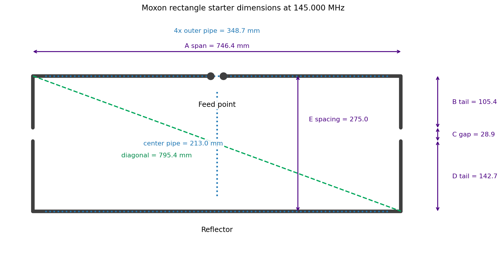

# Moxon Antenna Tuning Guide

This guide starts after the two printed T-pieces are available, the H-frame pipes are on hand, and enough wire is available for the driven element and reflector. It assumes a NanoVNA, RigExpert Stick, or similar 50 ohm antenna analyzer is available.

The goal is not only a low SWR. A Moxon rectangle is a coupled two-element antenna, so the final adjustment must preserve the geometry that gives the antenna its forward gain and rear null.

This guide has three layers:

1. **Theory** – how a Smith chart represents impedance and why an antenna's measured trace looks the way it does.
2. **Tooling** – how to set up a NanoVNA so the Smith chart actually shows the antenna, not the feed cable.
3. **Practice** – a step-by-step Moxon tuning procedure that reads the Smith chart at each step and ties it back to a specific dimension (`A`, `B`, `C`, `D`, `E`).

## Geometry Terms

Use the same dimension names as the calculator and theory note:



The image shows the plan-view antenna geometry for a 145 MHz starter build. The exact values will change with frequency, conductor diameter, velocity factor, and final tuning, but the letters keep the same meaning.

| Symbol | Meaning | Tuning role |
| --- | --- | --- |
| `A` | Horizontal span of the long driven side and the long reflector side | The left-to-right rectangle width. In the image, this is the purple `A span` arrow across the top. |
| `B` | Driven-element folded tail length at each end | The short vertical driven tails that turn down from the top driven element. In the image, this is `B tail`. |
| `C` | End gap between the driven tail and reflector tail | The small open space between the two facing wire ends on each side. In the image, this is `C gap`. |
| `D` | Reflector folded tail length at each end | The short vertical reflector tails that turn up from the bottom reflector. In the image, this is `D tail`. |
| `E` | Spacing between the driven side and reflector side | The front-to-back spacing between the top driven element and bottom reflector. In the image, this is `E spacing`. |

The blue dotted lines in the image are the H-frame pipe cuts for this kit, not electrical Moxon dimensions. They are derived from `A` and `E` after subtracting the printed-part offsets. The green dashed diagonal is a useful mechanical check that the rectangle is square and repeatable.

The driven element is split at the feed point. The reflector is continuous. The two `C` gaps must be equal, and the left and right halves must stay symmetrical.

## What To Optimize

Tune in this order:

1. Mechanical symmetry and repeatable dimensions.
2. Feed-point resonance at the intended center frequency.
3. Feed-point impedance near 50 ohms without using coax length as a hidden matching element.
4. Stable SWR with the feed line moved by hand.
5. Best practical front-to-back ratio in the final mounting orientation.

For FM repeater use, choose a center frequency in the part of the band you actually use. For weak-signal SSB/CW or satellites, tune for that operating segment, not for the middle of the whole amateur band.

## Smith Chart Theory For Antenna Tuning

This section is the "why" behind every later instruction that says "watch the Smith chart". It is written so that the practical steps make sense even if you have never used a Smith chart before.

### Reflection coefficient and normalized impedance

Everything on the chart is a plot of the **reflection coefficient** `Γ` (gamma), a complex number that compares the impedance at the measurement point `Z` to the analyzer's reference impedance `Z0` (50 ohms for a NanoVNA):

```
Γ = (Z - Z0) / (Z + Z0)
```

`Γ` is what the analyzer actually measures (as a magnitude and phase, or as S11). Everything else — SWR, return loss, R, X — is computed from `Γ`.

- `Z = Z0` (perfect 50 ohm match) → `Γ = 0`, the exact center of the chart.
- `Z = 0` (short circuit) → `Γ = -1`, the leftmost point of the chart.
- `Z = ∞` (open circuit) → `Γ = +1`, the rightmost point of the chart.

The Smith chart is the unit disk of `Γ` (radius 1, center 0) with a grid drawn on it that lets you read `Z` directly instead of `Γ`. The grid is built from the **normalized impedance** `z = Z / Z0 = r + jx`, where `r` is normalized resistance and `x` is normalized reactance. For a 50 ohm system, `z = 1` corresponds to 50 ohms.

### Reading the chart: resistance circles, reactance arcs, and the unit circle

- **Constant-resistance circles** (`r = const`) are circles that all pass through the open-circuit point at the right edge (`Γ = +1`). The `r = 1` circle (50 ohms) passes through the exact center of the chart. Larger `r` values are smaller circles closer to the right edge; `r = 0` is the entire outer unit circle.
- **Constant-reactance arcs** (`x = const`) are arcs that also all converge at the open-circuit point on the right edge. Arcs in the **upper half** of the chart are positive reactance (`x > 0`, **inductive**). Arcs in the **lower half** are negative reactance (`x < 0`, **capacitive**). The horizontal centerline itself is `x = 0` — purely resistive.
- The **outer unit circle** (`|Γ| = 1`) represents a perfect open or short — all the power is reflected, `r = 0`.
- The **center point** is `z = 1 + j0`, i.e. `50 + j0 ohms`, a perfect match to the analyzer.

To read an impedance from a marker, find which resistance circle the point sits on (read `r`, multiply by 50 for ohms) and which reactance arc it sits on (read `x`, multiply by 50 for ohms, and note whether it is above the centerline → `+jX` inductive, or below → `-jX` capacitive).

### SWR circles and the matched point

A circle centered on the chart's center point, of radius `|Γ|`, is a **constant-SWR circle**. Every impedance on that circle gives the same SWR, because SWR depends only on `|Γ|`:

```
SWR = (1 + |Γ|) / (1 - |Γ|)
```

A `1.5:1` SWR circle is a specific, fairly small circle around the center. The whole point of antenna tuning is to get the impedance trace, at the frequencies you care about, **inside that circle** — it does not have to sit exactly on the center point.

This is the key distinction that the SWR-only view hides: **resonance** (where `X = 0`, the trace crosses the horizontal centerline) and **match** (where the trace is close to the center, inside the target SWR circle) are related but not identical. A Moxon can be "resonant" at a frequency where `R` is, say, 30 ohms and `X = 0` — that crossing is on the centerline but well outside the 50 ohm point, so SWR is not at its best there. The Smith chart shows you both facts at once; the SWR plot alone only shows you the second.

### Why the trace moves: frequency sweeps and antenna resonance

When the NanoVNA sweeps frequency, it draws a **trace** — a sequence of `Γ` points, one per frequency — on the chart. For an antenna near its design frequency, this trace is typically a small loop or arc, not a single point.

A useful mental model, true for the Moxon's driven element as for a simple dipole:

- Below the antenna's natural resonant frequency, the element is **electrically too short** for that frequency → the feedpoint reactance is **capacitive** (`X < 0`, trace below the centerline).
- Above the natural resonant frequency, the element is **electrically too long** → the feedpoint reactance is **inductive** (`X > 0`, trace above the centerline).
- At resonance, `X = 0` and the trace crosses the horizontal centerline.

As frequency increases across a sweep, the trace for a simple resonant element generally moves in a loop, crossing the centerline once near the resistive minimum (the usable "series resonance" most builders tune for). Where that crossing sits relative to the `r = 1` (50 ohm) circle tells you immediately whether you are dealing with a length problem (crossing at the wrong frequency) or a resistance problem (crossing at the right frequency, but on the wrong resistance circle).

For the Moxon specifically, the coupled driven element + reflector behave like a single resonator at the feedpoint. A well-built Moxon at its design frequency shows the trace passing close to the chart center — close to `50 + j0 ohms` — with the centerline crossing close to the design frequency marker.

### Cable length, phase rotation, and why reference plane matters

Adding a length of transmission line between the analyzer and the antenna **rotates** the trace around the chart center without changing its size (its SWR circle stays the same — lossless line does not change SWR, only where on the SWR circle the impedance appears). One full rotation around the chart corresponds to one half-wavelength of line.

This matters because:

- A trace that looks "rotated" or "smeared" compared to what theory predicts is often just **uncalibrated cable length**, not a bad antenna.
- The same antenna measured through 0.5 m vs 5 m of coax can show very different `R + jX` numbers at the same frequency, even though the antenna itself has not changed.
- Calibration must be done **at the connector where the antenna feed line attaches**, so the reference plane (the point where `Γ = 0` means "50 ohms here") is at the antenna, not at the analyzer's own SMA port.

If you must measure through a longer cable than you calibrated with, the NanoVNA's **electrical delay** (sometimes called port extension or cable length compensation) can rotate the displayed trace back to the antenna's reference plane, by entering the cable's electrical length (physical length × velocity factor). This is covered in the next section.

### Putting it together: what a "good" Moxon trace looks like

For this kit, at the chosen center frequency, the practical target is:

- The trace crosses (or nearly crosses) the horizontal centerline (`X ≈ 0`) close to the marker for the target frequency.
- At that crossing, the trace is close to the `r = 1` circle (50 ohms) — ideally inside the `1.5:1` SWR circle around the center.
- The loop is smooth and repeatable when the antenna or cable is touched — a jumpy, erratic trace usually means a common-mode or connector problem (see [Feed Point And Choke Checks](#feed-point-and-choke-checks)), not a geometry problem.

Everything from here on is about moving that crossing point to the right frequency (driven element length, `B`/tails) and onto the right resistance circle (`C` gap, `E` spacing) without breaking the reflector relationship that gives the antenna its front-to-back ratio (`D`).

## Using The Smith Chart On A NanoVNA

This section covers the practical NanoVNA setup needed before any of the readings above are meaningful.

### Calibration at the right reference plane

1. Decide on the short jumper cable (and any adapter) that will permanently sit between the NanoVNA and the antenna feed point during tuning.
2. Set the sweep range first (see below) — calibration is frequency-range specific on the NanoVNA.
3. From the calibration menu, step through **Open**, **Short**, and **Load** standards connected at the **far end of that jumper/adapter** — i.e. at the point that will actually plug into the antenna. This far end becomes `Γ = 0`'s reference plane.
4. Save the calibration to a calibration slot so it can be reloaded without repeating OSL every session.
5. Reconnect the 50 ohm load at the same point and confirm `SWR ≈ 1.0:1` and `Z ≈ 50 + j0 ohms` across the whole sweep. If this fails, the rest of the session's readings cannot be trusted — fix cables, adapters, or redo calibration before continuing.

Calibrating at the analyzer's own port and then adding the jumper cable afterwards reintroduces the cable-rotation problem from the theory section above. Always calibrate at the plane where the antenna will connect.

### Sweep setup and display format

1. Set **Start** and **Stop** frequencies to a narrow span around the target band, not a wide general-coverage sweep. For 2 m, `140–150 MHz` is a good starting span; for 70 cm, `420–450 MHz` or narrower if the operating segment is known.
2. Use enough sweep points that the trace near resonance is smooth (the NanoVNA default of 101 points is usually fine for a 10 MHz span on 2 m).
3. Set up at least two trace displays:
   - One trace in **SWR** format — gives the quick "is it getting better or worse" view during iterative trimming.
   - One trace in **Smith chart** format — gives the `R + jX` diagnosis described in the theory section.
4. Optionally add a third trace in **|Z| / phase** or **LogMag (return loss)** format if the firmware supports it; these are not required but can help confirm a reading.
5. Turn off traces you are not using. A screen with one SWR trace and one Smith chart trace, each with a marker on the target frequency, is enough for all of the steps below.

### Markers and electrical delay / port extension

1. Place a marker at the target operating frequency. This marker's `R + jX` readout is the number you write into the tuning log.
2. Place a second marker at the frequency of the SWR minimum (`f_min_swr`). Comparing the two marker positions tells you immediately whether the antenna is resonant at the wrong frequency (markers at different frequencies but both near the centerline) or resonant at the right frequency but poorly matched (markers near the same frequency, but `R` far from 50 ohms).
3. If the jumper cable used for tuning is longer than the one used for calibration (for example, measuring on a mast through a longer feed line than the bench jumper), use the **electrical delay** / port extension setting to rotate the trace back to the antenna terminals. Enter the extra cable's electrical length (physical length divided by velocity factor, converted to a time delay) until a known reference (e.g. a 50 ohm load at the antenna end) reads `50 + j0` again.
4. Re-zero or remove any electrical delay before going back to the calibrated bench jumper, or all subsequent readings will be rotated by that amount.

### Time-domain check for feed line issues

If the trace looks erratic, shows multiple loops, or does not match expectations even after calibration:

1. Switch to the NanoVNA's time-domain / TDR (time domain reflectometry) mode if available (often a "transform" or "TDR" function operating on the Smith chart or S11 data).
2. Look for reflections at distances other than zero and the expected antenna length — these indicate bad connectors, kinks, water ingress, or an incorrect cable velocity factor.
3. Resolve feed-line issues before trusting any Smith chart reading for geometry tuning. A damaged feed line will move the trace in ways that look like a geometry problem but are not.

### Reading the live trace while tuning

While trimming the antenna:

1. Watch the **Smith chart trace** move as you make a change, not just the SWR number.
2. A driven-element length change should move the centerline crossing **along the frequency axis** (the loop shifts left/right in frequency) without changing its basic shape much.
3. A `C` gap or `E` spacing change should move the trace **toward or away from the center** (changing which resistance circle it sits on) more than it shifts the centerline crossing in frequency.
4. If a change does something unexpected — e.g. the trace jumps wildly, reverses direction, or stops looking like a smooth loop — suspect a connection problem, a broken symmetry (one side trimmed differently from the other), or common-mode coupling before assuming the dimension itself is wrong.

## Tools And Setup

Use these items before cutting anything permanently:

| Item | Use |
| --- | --- |
| NanoVNA, RigExpert Stick, or similar analyzer | Measure S11, SWR, return loss, impedance, Smith chart trace, and resonant frequency |
| Short 50 ohm coax jumper | Connect the analyzer to the antenna feed point — this is the calibration reference plane |
| Open/short/load calibration standards | Calibrate the analyzer at the end of the measurement cable |
| 50 ohm dummy load | Quick sanity check for the analyzer and coax, and for electrical delay setup |
| Ruler or calipers | Measure `C`, `E`, and wire lengths repeatably |
| Masking tape or heat-shrink markers | Mark the as-built wire positions before trimming |
| Small cable ties or clamps | Temporarily hold wire tails during tuning |
| Ferrite choke or several ferrite beads | Suppress common-mode current on the feed line |
| Low-power transmitter or receiver | Optional field check of front-to-back behavior |

## First Mechanical Build

1. Choose the exact center frequency.
2. Use the calculator to get `A`, `B`, `C`, `D`, and `E` for the actual wire diameter and insulation state.
3. If the wire is insulated, expect the real antenna to be electrically longer than a bare-wire calculation.
4. Assemble the two T-pieces and pipes into the H-frame.
5. Set the center pipe so the driven side and reflector side are separated by `E` at the wire positions, not just at the plastic or pipe centerline.
6. Cut the driven wire slightly long, with enough spare at each end to form the `B` tails and allow small trimming.
7. Cut the reflector wire slightly long, with enough spare at each end to form the `D` tails and allow small trimming.
8. Install the reflector as one continuous wire.
9. Install the driven element as two equal halves with a small feed gap at the center.
10. Make the feed-point leads short and symmetrical.
11. Set both `C` gaps to the calculator value.
12. Make the left-side `C` gap and right-side `C` gap as equal as possible.
13. Add a 1:1 current choke at the feed point or immediately below it.
14. Route the feed line away from the driven element at right angles for at least a short distance before it turns toward the operator or mast.

The first build should be adjustable. Do not solder, glue, or permanently crimp the final wire tails until the antenna has been measured in the intended orientation.

## Measurement Position

Measure the antenna in the same polarization and as close as practical to the intended operating setup.

1. Keep the antenna away from metal benches, cars, railings, gutters, tripods, and the operator's body.
2. For 2 m, try to keep people and metal at least `1 m` away during measurements.
3. For 70 cm, try to keep people and metal at least `0.5 m` away during measurements.
4. Hold or mount the antenna so the frame is not touching conductive objects.
5. Keep the analyzer behind or below the antenna, not inside the rectangle.
6. Do not let the coax run parallel along the driven element or reflector.

The exact height above ground changes the reading. That is normal. Tune at the height and mounting style that will actually be used when possible.

## First Sweep

Record these values before changing anything:

| Value | What to record |
| --- | --- |
| `f_min_swr` | Frequency where SWR is lowest |
| `SWR_min` | Lowest SWR value |
| `R` at target frequency | Resistive part of impedance |
| `X` at target frequency | Reactive part of impedance |
| `SWR` at target frequency | Match at the chosen operating frequency |
| `C_left` and `C_right` | Actual end gaps |
| `E` | Actual driven-to-reflector spacing |

Read the Smith chart trace as described above:

- Find where the trace crosses the horizontal centerline (`X = 0`). Compare that frequency to the target frequency and to `f_min_swr`.
- Note which resistance circle the trace is on at the target frequency marker — is it inside, on, or outside the `r = 1` (50 ohm) circle?
- Note whether the target-frequency point is above the centerline (inductive, element electrically long) or below it (capacitive, element electrically short).

These three observations are exactly the inputs the tuning steps below ask for.

## How Geometry Maps To The Smith Chart Trace

Before trimming anything, it helps to know what each dimension does to the trace. This table summarizes the practical effect of each Moxon dimension on the Smith chart, based on general dipole/parasitic-array behavior and Moxon-specific build notes (see References).

| Dimension | Primary Smith chart effect | Secondary effect |
| --- | --- | --- |
| `B` (driven tail length) — and overall driven element length | Shifts the centerline (`X = 0`) crossing along the frequency axis. Shorter → crossing moves up in frequency and the target-frequency point becomes more capacitive (moves below centerline). Longer → crossing moves down in frequency and the point becomes more inductive (moves above centerline). | Small effect on `R` at resonance |
| `C` (end gap, driven-to-reflector tail spacing) | Changes the coupling between driven and reflector tails, which mainly changes which resistance circle the trace sits on at resonance (moves the trace toward or away from the `r = 1` / 50 ohm circle) and the size/shape of the loop. | Can also shift the centerline crossing slightly; re-check resonance after changing `C` |
| `E` (driven-to-reflector spacing) | Changes the overall resistance level of the trace (shifts which resistance circle the loop sits on), and reshapes the loop. | Affects the radiation pattern together with `R`; do not use as the first correction for a frequency error |
| `D` (reflector tail length) | Small direct effect on the feedpoint trace; its main job is front-to-back ratio, not match. | Can interact with `C` and `E` at the margins |
| `A` (overall span) | Sets the overall scale of the design; in practice this kit treats `A` as fixed by the calculator and the H-frame, not as a field-tuning control. | — |

In short: **`B` (driven length) moves the loop left/right in frequency. `C` and `E` move the loop toward/away from the chart center (the resistance value). `D` is mostly about the pattern, not the trace.**

## Main Tuning Rule

Tune the driven element first.

| Symptom (SWR view) | Smith chart confirmation | Likely cause | First correction |
| --- | --- | --- | --- |
| SWR dip is below the target frequency | Centerline crossing is below the target frequency; target-frequency point sits above the centerline (inductive) | Driven element is electrically too long | Shorten both driven halves equally |
| SWR dip is above the target frequency | Centerline crossing is above the target frequency; target-frequency point sits below the centerline (capacitive) | Driven element is electrically too short | Lengthen both driven halves equally if possible |
| SWR dip is near target but minimum SWR is not good | Centerline crossing is near the target frequency, but the trace there is on a resistance circle far from `r = 1` (50 ohms) | Coupling or feed impedance issue | Adjust `C`, then check `E` only if needed |
| Reading changes when the coax is moved | Trace shifts or becomes erratic/jumpy when the cable is touched | Common-mode current or feed-line coupling | Improve choke and feed-line routing before trimming |
| One side tunes differently from the other | Trace behaves inconsistently between repeated measurements at the same nominal settings | Asymmetry | Re-measure `B`, `C`, `D`, feed gap, and wire routing |

For an antenna that was intentionally built slightly long, the normal path is to trim upward in frequency. Trim in small equal steps and re-measure after every change.

## Driven Element Length Adjustment

The driven element controls resonance most directly — on the Smith chart, it controls **where the trace crosses the centerline (`X = 0`)**.

1. Read the Smith chart at the target frequency. If the point sits **above** the centerline (positive `X`, inductive), the element is electrically too long for this frequency.
2. If the point sits **below** the centerline (negative `X`, capacitive), the element is electrically too short.
3. If the SWR minimum is below the target frequency (centerline crossing too low in frequency, target point inductive), mark both driven tails.
4. Shorten the driven element by the same amount on both ends.
5. Start with very small cuts.
6. For 2 m, use steps of about `2 mm` to `5 mm` per driven end.
7. For 70 cm, use steps of about `0.5 mm` to `2 mm` per driven end.
8. Restore both `C` gaps to the intended value after each trim.
9. Re-measure the full sweep and re-check the Smith chart: the centerline crossing should move toward the target frequency, and the target-frequency point should move down toward the centerline (less inductive).
10. Stop trimming when the centerline crossing is at, or slightly below, the target frequency, and the target-frequency point is close to the centerline (small `|X|`).

If the SWR minimum is above the target frequency (target point capacitive), the driven element is short. Do not trim anything else to compensate. Lengthen the driven tails if there is spare wire, add small extensions, or rebuild the driven wire longer. On the Smith chart, lengthening should move the centerline crossing down in frequency and move the target-frequency point up toward (and eventually above) the centerline.

Do not shorten only one driven end. The feed point must remain centered, and the two driven halves must remain equal.

## End Gap `C` Adjustment

The `C` gaps are Moxon-specific tuning controls. They are not just mechanical clearances.

The gaps set the capacitive coupling between the driven tails and reflector tails. On the Smith chart, changing `C` mainly moves the trace **toward or away from the chart center** — i.e. it changes which resistance circle the resonant point sits on — rather than shifting the centerline crossing in frequency. Small changes can move impedance and affect the rear null. Equal gaps are more important than a visually perfect rectangle.

Use this procedure only after the resonance is close to the target frequency (the centerline crossing is near the target frequency from the previous step):

1. Measure and write down both `C` gaps.
2. Change both gaps by the same amount.
3. Use very small steps.
4. For 2 m, use about `1 mm` to `2 mm` per step.
5. For 70 cm, use about `0.3 mm` to `1 mm` per step.
6. After every step, re-measure SWR, the Smith chart trace, and front-to-back behavior if possible. Check whether the target-frequency point has moved closer to or further from the center (`r = 1`, 50 ohm circle).
7. If `C` also shifted the centerline crossing noticeably, return to the driven-element step before continuing — keep the two adjustments from fighting each other.
8. Keep the reflector and driven tails parallel at both ends.

Typical effects:

| Change | Common result (Smith chart view) |
| --- | --- |
| Smaller `C` | More coupling; trace tends to move further from the center, impedance changes more strongly, rear null may shift |
| Larger `C` | Less coupling; trace tends to move toward a different resistance circle, pattern may become less Moxon-like, rear rejection may degrade |
| Unequal `C` gaps | Trace becomes inconsistent between repeated measurements; pattern becomes asymmetric and readings can become confusing |

There is no universal rule that smaller or larger `C` always improves SWR. Use measured data. If SWR improves but front-to-back ratio gets worse, do not keep that change unless match is the only priority.

## Spacing `E` Adjustment

Adjust `E` only after the driven length and `C` gaps are close — i.e. the centerline crossing is near the target frequency and the target-frequency point is reasonably close to the center. `E` changes the spacing between driven element and reflector, so on the Smith chart it mainly reshapes the trace and shifts its resistance level, affecting impedance and radiation pattern together.

1. Check that the center pipe and T-pieces really place the wire positions at `E`.
2. If the feed resistance near resonance is far from 50 ohms (the target-frequency point sits on a resistance circle well away from `r = 1`) and `C` alone cannot bring it back without unacceptable side effects, test a small `E` change if the frame allows it.
3. Move both sides consistently so the driven and reflector wires remain parallel.
4. For 2 m, test changes around `2 mm` to `5 mm`.
5. For 70 cm, test changes around `0.5 mm` to `2 mm`.
6. Re-check `C` after changing `E`; changing the spacing may also move the tail positions.
7. Re-check the centerline crossing too — `E` changes can shift resonance slightly even though its main effect is on resistance.

Do not use `E` as the first correction for a frequency error. If the resonance is in the wrong place, correct the driven length first.

## Reflector Adjustment

The reflector is parasitic and strongly affects the front-to-back ratio. Its effect on the feedpoint Smith chart trace is small compared to `B`, `C`, and `E` — it should normally stay at the calculator value while the driven element is tuned.

Adjust the reflector only if:

1. The driven resonance is correct (centerline crossing at the target frequency).
2. The feed line is choked and stable.
3. Both `C` gaps are equal.
4. The match is acceptable (target-frequency point inside the target SWR circle).
5. The front-to-back ratio is poor in a repeatable field test.

If the rear null is weak, test tiny reflector-tail (`D`) changes symmetrically. A practical way to do this without permanently cutting wire: temporarily attach a short test wire to one reflector tail end and fold an extra length in or out while watching the field-strength front-to-back check; only cut the reflector once a folded change has proven to improve front-to-back. A longer reflector tends to act more reflector-like, but too much length or poor end-gap spacing can hurt both match and pattern. Keep notes because reflector changes can be harder to interpret than driven-element trims, and re-check the Smith chart trace afterward — `D` changes should leave the centerline crossing and resistance level close to where they were before, since `D`'s main job is the pattern, not the match.

## Feed Point And Choke Checks

A Moxon often matches close to 50 ohms, but the feed line can become part of the antenna if the feed is not controlled.

1. Use a short, mechanically stable feed gap at the center of the driven element.
2. Keep both feed leads the same length.
3. Do not run the coax along one half of the driven element.
4. Add a current choke at the feed point.
5. At VHF/UHF, ferrite beads on the coax near the feed point are often more practical than many coax turns.
6. Move the coax by hand while watching the Smith chart trace, not just the SWR number.
7. If the trace moves significantly, jumps between sweeps, or stops forming a smooth loop when the coax is touched, improve the choke and routing before doing more tuning.

If the antenna only looks good with one special coax length or one special cable route, it is not tuned yet. It is using the feed line as part of the matching system. This is also visible on the Smith chart as a trace that rotates around the chart (changes apparent `R + jX` without a clean loop shape) when the cable is moved — a symptom of feed-line phase rotation interacting with common-mode current, as described in the cable-length theory above.

## Iterative Tuning Log

Use a log like this. The antenna will tune faster if every change is measured.

| Step | Change made | `C_left` | `C_right` | `E` | `f_min_swr` | `f_X=0` (centerline crossing) | `SWR_min` | `R + jX` at target | F/B note |
| --- | --- | --- | --- | --- | --- | --- | --- | --- | --- |
| 0 | Initial build | | | | | | | | |
| 1 | Trim driven ends | | | | | | | | |
| 2 | Adjust `C` | | | | | | | | |
| 3 | Check choke/feed route | | | | | | | | |

Recording `f_X=0` (the Smith chart centerline crossing) separately from `f_min_swr` makes it much easier to tell, after the fact, which dimension actually fixed which problem.

## Front-To-Back Field Check

An analyzer cannot measure gain or front-to-back ratio directly. It only measures the feed-point match — i.e., the Smith chart trace. A Moxon can have low SWR and still have a poor rear null if the geometry is wrong.

Use a stable signal source:

1. Choose a beacon, repeater, handheld transmitter, or low-power test transmitter on the target frequency.
2. Place the signal source far enough away that it is not in the near field.
3. For 2 m, use at least several meters of separation; more is better.
4. For 70 cm, use at least a few meters of separation; more is better.
5. Keep the signal source at the same polarization as the Moxon.
6. Point the Moxon directly at the signal and record the received level.
7. Rotate the Moxon exactly 180 degrees and record the received level from the rear.
8. Repeat after `C` changes and any reflector-tail changes.

The rear null may be narrower than the forward lobe. Rotate slowly through the rear direction and look for the deepest null. If the best null is not directly behind the antenna, suspect unequal `C` gaps, unequal wire lengths, feed-line radiation, or nearby objects.

## Final Lock-Down

When the antenna is tuned:

1. Record final `A`, `B`, `C`, `D`, `E`, feed gap, wire type, and insulation state.
2. Record the final analyzer sweep (SWR and Smith chart) or save a screenshot.
3. Mark the wire positions on the pipes or printed parts.
4. Secure the wire so vibration cannot change the `C` gaps.
5. Secure the feed cable so it always leaves the antenna the same way.
6. Re-measure after final soldering, crimping, heat-shrink, or glue.
7. Re-measure again in the final operating position.

Expect a small shift after final assembly. Heat-shrink, cable ties, solder lugs, coax position, wet plastic, and nearby hands can all affect VHF/UHF measurements.

## Troubleshooting

| Problem | Check first | Smith chart signature | Moxon-specific cause |
| --- | --- | --- | --- |
| No clear SWR dip | Analyzer calibration and feed continuity | Trace stays near the outer unit circle (reflection coefficient magnitude near 1) across the whole sweep | Driven element may not be split correctly or reflector may contact driven wire |
| Dip is much too low | Driven element too long | Centerline crossing below the target frequency; target point inductive (above centerline) | Insulated wire or extra feed hardware made it electrically longer |
| Dip is much too high | Driven element too short | Centerline crossing above the target frequency; target point capacitive (below centerline) | Trimmed too far or calculator used wrong frequency/diameter |
| Good SWR but poor directionality | Pattern was not preserved | Trace looks fine (near center at target frequency), but field check shows poor F/B | `C` gaps unequal, reflector wrong length, feed line radiating |
| SWR changes when touched | Common-mode current | Trace jumps or loses its smooth loop shape when the coax is moved | Choke missing or ineffective, coax routed through active field |
| SWR changes after tightening parts | Geometry changed | Centerline crossing or resistance level shifts between "before" and "after" sweeps | `C` or `E` moved during lock-down |
| Different readings indoors and outdoors | Environment changed | Whole trace shifts slightly between locations without any mechanical change | Nearby metal, ground height, walls, or operator body detuned the antenna |
| Trace rotates / smears when cable is moved or lengthened | Calibration reference plane | Trace keeps its size (same SWR circle) but rotates around the chart center | Calibration done at the wrong end of the cable, or electrical delay not set for the cable in use |

## Practical Targets

These are realistic field targets for a simple kit build:

| Target | Good result |
| --- | --- |
| Resonance | Smith chart centerline crossing (`X = 0`) near the chosen operating frequency |
| Feed impedance | Close to `50 ohms` resistive with low reactance near target — trace close to chart center at the target frequency |
| SWR | Below `1.5:1` across the intended operating segment is usually excellent — trace inside the `1.5:1` SWR circle |
| Feed stability | Small Smith chart trace movement when coax is moved after choking |
| Pattern | Clear forward preference and a repeatable rear null |

Do not sacrifice a strong, repeatable rear null just to change SWR from `1.4:1` to `1.1:1`. For a directional Moxon, pattern quality is part of antenna performance.

## References

| Reference | How it was used |
| --- | --- |
| [Moxon Rectangle Antenna Theory](notebooks/moxon_theory.md) | Existing repo theory note for dimension names, H-frame terminology, feed-point notes, and limitations. |
| [W6BSD Moxon Antenna Calculator](https://0x9900.com/moxon-antenna-calculator/) | Existing repo calculator reference for first-cut Moxon dimensions. |
| [3G-aerial Moxon Antenna Calculator with Model Export](https://3g-aerial.biz/en/online-calculations/antenna-calculations/moxon-antenna-calculator) | Confirms `A`, `D`, reflector length terminology and notes that calculations are based on Cebik/W4RNL formulas with MoxGen-style empirical corrections, not NEC optimization. |
| [AC6LA MoxGen](http://www.ac6la.com/moxgen.html) | Classic Moxon Rectangle Generator reference used by many builders for 50 ohm Moxon dimensions from frequency and wire size. |
| [L. B. Cebik, W4RNL: The Moxon Rectangle: A Review](http://www.antentop.org/w4rnl.001/mox20.html) | Background on Moxon geometry, modeling, feed impedance, and pattern behavior. |
| [Cebik, W4RNL: Building a 2-Meter Moxon](https://antenna2.github.io/cebik/content/moxon/moxbld.html) | Practical build notes confirming `C` gap is the most sensitive dimension and describing an adjustment sequence: lengths first, then gap, then driver-reflector spacing. |
| [Moxon Antenna Project](https://moxonantennaproject.net/index.html) | Practical Moxon antenna project archive with builder examples, dimensions, and model references. |
| [Wikipedia: Moxon antenna](https://en.wikipedia.org/wiki/Moxon_antenna) | General overview of the Moxon as a compact two-element parasitic array and notes about VHF/UHF tubing builds and wavelength-sensitive reflector placement. |
| [G1YBB: Easy building of a Moxon antenna with 4NEC2](https://g1ybb.uk/easy-building-of-a-moxon-antenna-with-4nec2/) | Practical note that insulated wire can shift resonance and that modeling or measurement should validate calculator dimensions. |
| [Radio-Stuff: Building the 2m Moxon Kit](https://www.radio-stuff.com/post/building-the-2m-moxon-kit) | Practical 2 m kit-building reference, including equal trimming and the observation that MoxGen dimensions may build electrically long depending on height and insulated wire. |
| [SM5JAB: Even Simpler Moxon Tuning](https://antjab.wordpress.com/2012/06/07/even-simpler-moxon-tuning/) | Practical field-tuning technique: tune the reflector first for front-to-back using a temporary folded test wire, then tune the driven element for SWR. |
| [NanoVNA practical guide: calibration, antenna measurements](https://nexttechworld.com/rf-test-equipment/nanovna-practical-guide/) | Measurement guidance for S11, SWR, impedance, resonance, feedline effects, and choke validation. |
| [Keystone Amateur Radio Society: Tuning and Testing Antennas with the NanoVNA](https://karsqth.org/tuning-and-testing-antennas-with-the-nanovna-a-starters-guide) | Basic NanoVNA antenna workflow: narrow sweep, open/short/load calibration, SWR dip interpretation, and length correction. |
| [NodakMesh: NanoVNA Antenna Testing Guide](https://nodakmesh.org/blog/nanovna-antenna-testing-guide) | Practical reminder that NanoVNA measurements show match and resonance, not gain, and that low SWR alone does not prove antenna performance. |
| [Johnson Francis (Techworld): Mastering the Smith Chart in NanoVNA](https://johnsonfrancis.org/techworld/mastering-the-smith-chart-in-nanovna/) | Practical description of NanoVNA Smith chart layout: inductive/capacitive halves, resistance circles, center-point match, and reading the live trace. |
| [NanoRFE: Beginner's Guide — How to use a NanoVNA](https://nanorfe.com/how-to-use-nanovna.html) | Step-by-step NanoVNA calibration (SOLT), sweep range setup, and trace/display configuration for antenna tuning. |
